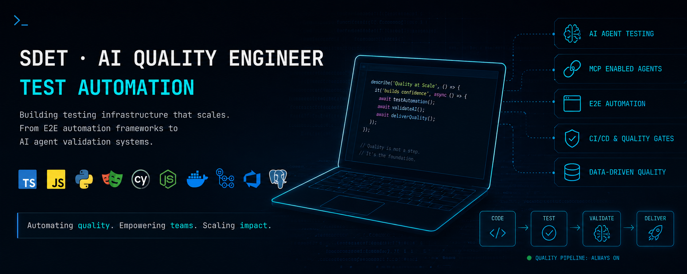

# Daniel Díaz

**SDET · AI Quality Engineer · Test Automation**

I build testing infrastructure that scales: from E2E automation frameworks to AI agent validation systems.

Currently at **CloudX → EY**, leading AI testing practices and developing production-ready MCP-enabled agents.

## Stack

## Highlights

- Architected AI agent testing methodologies, first implementation at EY
- Built two production MCP agents: **QA Explorer** (automated test generation & quality reporting) and **BA Agent** (requirements analysis & SRS optimization)
- Created reusable Playwright authentication modules adopted across multiple EY teams
- Mentored 20+ QA engineers transitioning from manual to automation testing at UPEX

## Experience

| Company | Role | Period |
|---------|------|--------|
| CloudX → EY | 	SDET / QA Automation | Feb 2025 – Present |
| CloudX → Central State MFG | 	SDET / QA Automation | Sep 2024 – Feb 2025 |
| Decrypto.la | 	SDET / QA Automation | Apr 2024 – Aug 2024 |
| tuGerente | SDET / QA Automation | Dec 2022 – Apr 2024 |
| UPEX | QA Automation Engineer & Mentor | May 2022 – Jan 2026 |

## Connect

